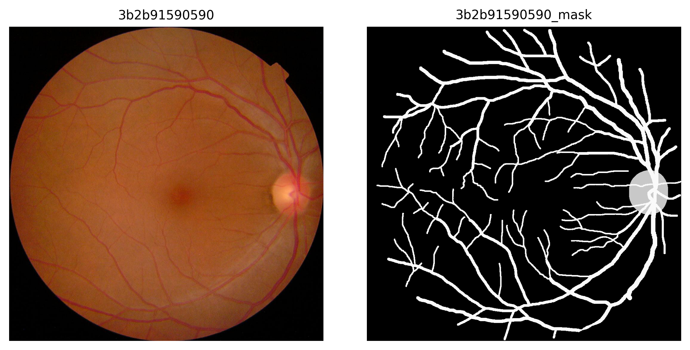
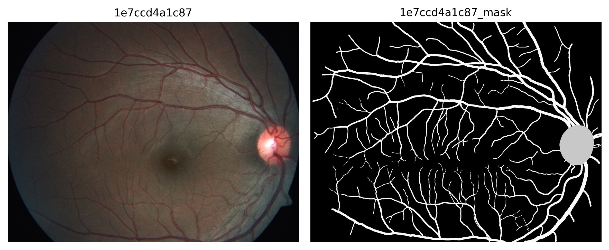

# 🩺 Fundus Image Segmentation Masks: Vascular Arcade and Optic Nerve

## 📘 Overview

This dataset provides **annotated segmentation masks** of fundus images, focusing on two clinically significant ophthalmic structures: **the vascular arcade** and **the optic nerve**.  

It includes **500 images** from the *Asia Pacific Tele-Ophthalmology Society 2019 Blindness Detection (APTOS 2019 BD)* dataset, aiming to support the development and evaluation of segmentation models in the field of **computational ophthalmology**.

The dataset is especially useful for **training**, **benchmarking**, and **fine-tuning** algorithms applied to the analysis of retinal images.

---

## 🧩 Dataset Description

The dataset consists of **annotated segmentation masks** corresponding to **500 fundus images** from the *APTOS 2019 Blindness Detection Dataset*, publicly available on [Kaggle](https://www.kaggle.com/competitions/aptos2019-blindness-detection).  

> ⚠️ **Note:** The original images are **not included** in this repository, as they belong to the APTOS dataset.  
> Instead, this repository provides the **generated masks and annotations** for those same 500 images, focusing on two key ophthalmic structures: the vascular arcade and the optic nerve.

The masks are provided in **PNG format** and include **three pixel-coded classes**:

| Pixel Value | Class            |
|--------------|------------------|
| 0            | Background       |
| 1            | Vascular Arcade  |
| 2            | Optic Nerve      |

Each mask preserves the same filename as its corresponding image from the APTOS dataset, ensuring a **direct one-to-one correspondence** between both data sources.

Mask resolutions range from **474×358 pixels** to **4288×2848 pixels**, matching the original APTOS image dimensions.

Additionally, the dataset includes an **`annotations_COCO.json`** file in **COCO 1.0 format**, which can be used to regenerate the masks or integrate them into **custom segmentation pipelines**.

---

## 🖼️ Visual Example of the Dataset

  

  

  

<em>Figure 1. Representative examples of the fundus dataset and their corresponding annotated masks.</em>

---

## ⚙️ Dataset Usage

The repository can be used in two different ways, depending on user needs:

### 🔹 Direct Use
The **500 pre-generated masks** included in the repository can be used directly for **training or evaluating** segmentation models.

### 🔹 Custom Generation
The provided **Python script** allows **converting COCO-format annotations** into segmentation masks for the vascular arcade and optic nerve, automatically saving them as **PNG files**.

---

## 🧾 License

This dataset is distributed under the **[Apache 2.0 License](https://www.apache.org/licenses/LICENSE-2.0)**, which permits use, modification, and redistribution, provided that **proper credit is given to the original authors**.

---

## 🧠 References

- **APTOS 2019 Blindness Detection Dataset.**  
  Available at: [https://www.kaggle.com/competitions/aptos2019-blindness-detection](https://www.kaggle.com/competitions/aptos2019-blindness-detection)

---

## 👩‍💻 Authors and Contact

- **Bryan Alejandro Figueroa Garza** — [bryan.figueroa.garza@uabc.edu.mx](mailto:bryan.figueroa.garza@uabc.edu.mx)  
- **Betsaida Lariza López Covarrubias** — [lariza.lopez@uabc.edu.mx](mailto:lariza.lopez@uabc.edu.mx)  
- **Laura Johana González Zazueta** — [lgonzalez85@uabc.edu.mx](mailto:lgonzalez85@uabc.edu.mx)  
- **Francisco Alcaraz Quiñónez** — [alcarazf@uabc.edu.mx](mailto:alcarazf@uabc.edu.mx)  
- **Juan Iván Nieto Hipólito** — [jnieto@uabc.edu.mx](mailto:jnieto@uabc.edu.mx)  
- **Gener José Avilés Rodríguez** — [aviles.gener@uabc.edu.mx](mailto:aviles.gener@uabc.edu.mx)

---

💬 For questions, comments, or suggestions, you can **contact the authors directly** or **open an [issue](https://docs.github.com/en/issues/tracking-your-work-with-issues/about-issues)** in this repository.

